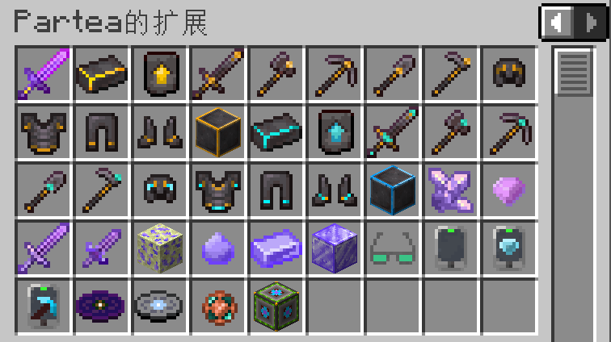

# [1.20.4]Partea Expansion-1.20.4模组项目文档

## 新增物品

1. 创造模式神剑(creative_mode_sword)，仅创造模式获得，攻击力足以秒杀实体

2. 黄金下界合金系列(golden_netherite)，由下界合金锻造升级而来，挖掘等级4
3. 钻石下界合金系列(diamond_netherite)，由黄金下界合金锻造升级而来，挖掘等级5
4. 紫水晶粗制物(crude_amethyst)
5. 紫晶钻(amethyst)：由紫水晶粗制物质变而来
6. 紫水晶剑(amethyst_sword)：基础攻击和耐久均较低，跳劈无法暴击，耐久越低，伤害越高
7. 紫水晶匕首(amethyst_stilleto)：拥有22点基础攻击力，但耐久仅有1点
8. 蔚蓝矿(azure_ore)：需挖掘等级5，掉落蔚蓝结晶
9. 【未实装】蔚蓝结晶(raw_azure)，蔚蓝锭(azure_ingot)，蔚蓝块(azure_block)
10. 夜视眼镜(night_vision_glasses)：提供夜视效果与少量护甲
11. 闲置终端(empty_terminal)：中间产物，本身无用
12. 探矿器(diamond_prospector)：探测一个方块上下的原版Minecraft矿石
13. 安全采矿检测器(safemining_detector)：检测可否在此垂直下挖
14. 音乐唱片Shed A Light(shed_a_light_music_disc)与Silent Time(silent_time_music_disc)，分别出现在末地城与藏宝图宝藏中
15. 物品过滤器(item_filter)：设置自动吸取物品白名单或黑名单
16. 参量质变仪(qualitative_analyzer)：用于质变部分物质

## 新增机制

1. 真实物品掉落，物品可以平躺在地面上而不会再原地旋转
2. 皮革能代替兔子皮合成收纳袋
3. 附魔金苹果、三叉戟、钻石马铠与金马铠可合成
4. 在沙漠神殿考古有概率获得紫水晶
5. 新增村民职业下界探险家(nether_explorer)
6. 新增进度赛博科技(cybertech)，还有高手！(more_power)，这就是洪荒之力？(is_it_the_ultimate_power)

## 原版内容修改

1. 鱿鱼与发光鱿鱼有40%的概率掉落黏液球
2. 退出附魔台界面，放入的青金石不会弹出
3. 学徒石匠新增收购原石与深板岩的交易