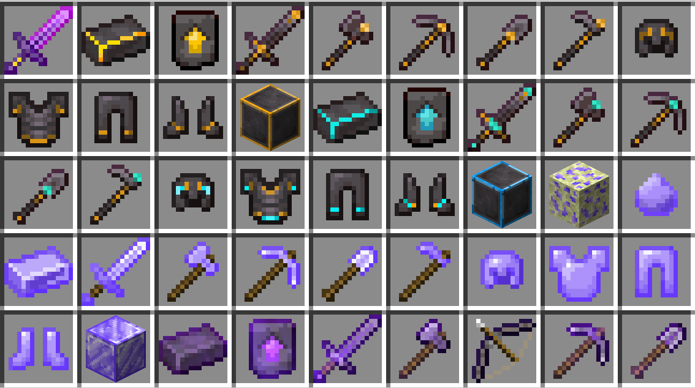
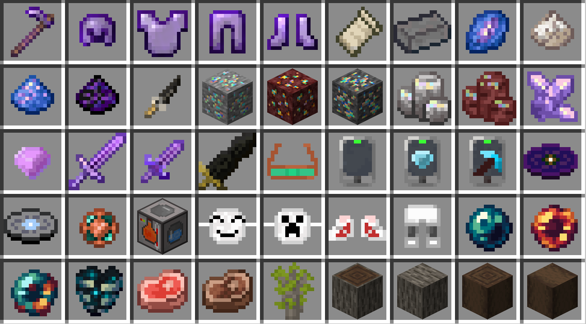
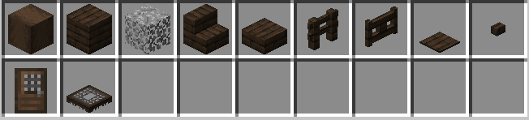

# [1.20.4]Partea Expansion-beta1.13模组项目文档

## 描述
本模组旨在优化与拓展原版玩法，增强探索体验

## 前置模组
1. owo-lib CurseForge链接：https://www.curseforge.com/minecraft/mc-mods/owo-lib
         （https://maven.wispforest.io/io/wispforest/owo-lib/）
## 推荐模组
1. Enchantment Descriptions(附魔描述):https://www.curseforge.com/minecraft/mc-mods/enchantment-descriptions
2. Bookshelf(Enchantment Description前置模组):https://www.curseforge.com/minecraft/mc-mods/bookshelf
3. Iris Shaders(加载光影):https://www.curseforge.com/minecraft/mc-mods/irisshaders
4. Sodium:https://www.curseforge.com/minecraft/mc-mods/sodium
5. Indium(Sodium扩展):https://www.curseforge.com/minecraft/mc-mods/indium

## 新增物品

1. 创造模式神剑(creative_mode_sword)，仅创造模式获得，攻击力足以秒杀实体
2. 黄金下界合金系列(golden_netherite)，由下界合金锻造升级而来，挖掘等级5，全套护甲提供抗火效果
3. 钻石下界合金系列(diamond_netherite)，由黄金下界合金锻造升级而来，挖掘等级5，全套护甲提供抗火与抗性提升
4. 蔚蓝银矿(azure_ore)：需挖掘等级5，无视精准采集，有概率掉落一枚蔚蓝结晶，自然生成于末地外岛
5. 蔚蓝结晶(raw_azure)
6. 蔚蓝银锭(azure_ingot)：由蔚蓝结晶传奇质变而来
7. 蔚蓝银系列装备(azure)：挖掘等级5，略逊于钻石下界合金，由蔚蓝银锭直接合成而来，全套护甲提供生命回复
8. 蔚蓝合金系列装备(azurite)：挖掘等级6，本模组op装备，全套护甲提供生命回复、抗性提升与抗火。有两种合成方案，使用蔚蓝合金升级模版+钻石下界合金装备+蔚蓝银装备（仅保留中间格装备附魔），使用蔚蓝合金升级模版+钻石下界合金装备/蔚蓝银装备+蔚蓝合金锭合成。蔚蓝合金弓自带无限、高伤害且拥有极短的蓄力时长，锻造台上使用蔚蓝合金升级锻造模版+弓+蔚蓝合金锭合成。
9. 织物(fabric)：作为合成材料或用于物品修复，由线合成
10. 玄武岩砖(basalt_brick)：平滑玄武岩烧制而来，用于制作远古珍珠
11. 结晶青金石(crystallized_lapis)：有青金石与紫水晶碎片合成而来
12. 石英粉(quartz_dust)：石英与燧石合成，用于催化质变的普通材料
13. 结晶青金石粉(crystallized_lapis_dust)：结晶青金石合成，用于催化质变的罕见材料
14. 哭泣黑曜石粉(crying_obsidian_dust)：哭泣黑曜石与钻石合成，用于催化质变的稀有材料
15. 燧石小刀(flint_knife)：由燧石与木棍制作的武器，近战表现并不出色，但丢出去伤害很高
16. 可疑的矿石、可疑的下界矿石、可疑的深板岩矿石(suspicious_ore,nether_suspicious_ore,deepslate_suspicious_ore)：主世界或下界生成，挖掘后掉落可疑的石头或可疑的下界石头
17. 可疑的石头、可疑的下界石头(suspicious_stone,nether_suspicious_stone)：在参量质变仪中进行普通质变能转化为随机的矿物，可疑的下界石头有更好的产出
18. 可疑的鳞片(suspicious_squama)：质变可疑的石头或可疑的下界石头小概率获得，用于酿造化身蜥蜴药水
19. 紫水晶粗制物(crude_amethyst)：由紫水晶碎片合成
20. 紫晶钻(amethyst)：由紫水晶粗制物罕见质变而来
21. 紫水晶剑(amethyst_sword)：基础攻击和耐久均较低，跳劈无法暴击，耐久越低，伤害越高,无法附魔
22. 紫水晶匕首(amethyst_stilleto)：拥有22点基础攻击力，但耐久仅有1点，无法附魔
23. 黑剑(black_sword)：攻击力高但攻速慢的大剑，无法附魔，攻击会造成命定之死
24. 夜视眼镜(night_vision_glasses)：装备于头部，提供夜视效果与少量护甲，合成获得，使用铜锭修复
25. 闲置终端(empty_terminal)：中间产物，本身无用
26. 探矿器(diamond_prospector)：探测所选方块上下的矿石
27. 安全采矿检测器(safemining_detector)：检测在此垂直下挖是否安全
28. 音乐唱片Shed A Light(shed_a_light_music_disc)与Silent Time(silent_time_music_disc)，分别出现在末地城与藏宝图宝藏中
29. [禁用中]物品过滤器(item_filter)：设置自动吸取物品白名单或黑名单
30. 参量质变仪(qualitative_analyzer)：用于进行质变
31. 欢愉之面(fools_mask)：装备于头部，提供少量护甲，穿戴后能直视末影人，击杀敌人能叠加力量效果，最多叠加到三级，受到攻击后消失，仅在地牢与林地府邸生成，使用织物修复
32. 惊悚假面(thriller_mask)：装备于头部，提供少量护甲，穿戴后获得速度、跳跃提升、力量、急迫以及饥饿、霉运效果，击杀苦力怕有极小概率获得
33. 运动鞋(sneaker)：提供少量护甲，穿上后获得大幅提高速度，使用织物修复
34. 护膝裤(knee_pads)：提供少量护甲，穿上后免疫摔落伤害，使用织物修复
35. 远古珍珠(ancient_pearl)：能搜寻附近的远古城市或激活古代城传送门框架，由末影珍珠或末影之眼与玄武岩砖合成而来
36. 绯红珍珠(crimson_pearl)：能搜寻下界要塞，但是由于minecraft疑似存在对下界要塞中心定位不准的问题，珍珠指向的目标位置与要塞位置会有一点偏差，由末影珍珠或末影之眼与下界砖合成
37. 贪欲珍珠(avaricious_pearl)：能搜寻堡垒遗迹，由末影珍珠或末影之眼与金粒合成
38. 深邃心脏(heart_of_the_deep)：击杀监守者必定掉落
39. 生马肉(horse_meat)：马掉落
40. 熟马肉(cooked_horse_meat)：烹饪生马肉获得
41. 棕木系列方块(palm)

## 新增机制

1. 皮革能代替兔子皮合成收纳袋
2. 白色羊毛能分解产生线
3. 鱿鱼与发光鱿鱼有40%的概率掉落黏液球
4. 附魔金苹果、三叉戟、钻石马铠与金马铠可合成
5. 在沙漠神殿考古有概率获得紫水晶
6. 部分功能方块ui材质改动
7. 末地外岛新增多种自然生成结构，丰富末地外岛的探索体验
8. 新增进度赛博科技(cybertech)，还有高手！(more_power)，这就是洪荒之力？(is_it_the_ultimate_power)，安如磐石(as_solid_as_a_rock)
9. 退出附魔台界面，放入的青金石不会弹出
10. 学徒石匠新增收购原石与深板岩的交易
11. 真实物品掉落，物品可以平躺在地面上而不会再原地旋转，右键可直接拾取物品，长按丢弃键能蓄力丢出，带有伤害词条的物品丢出后能造成伤害
12. 用水桶收纳美西螈，获得的美西螈桶材质将能够反映美西螈的年龄与颜色
13. 猪灵堡垒桥结构的宝箱增加战利品池，必定获得熔岩漫步附魔书与远古残骸其一
14. [巡猎]附魔书可以在村庄获得
15. [毁灭]附魔书可以在林地府邸以及掠夺者前哨站集中产生
16. [存护]附魔书可以在堡垒遗迹、下界要塞、废弃传送门中获取
17. [虚无]附魔书可以在末地外岛探索宝箱获得
18. [丰饶]附魔书可以在海洋诸多宝箱中获得
19. 下界合金碎片与下界岩可合成为远古残骸
20. 命名牌可由织物、线与拴绳合成
21. 新增药水效果及相关药水物品： 
    1. 命定之死(doomed_death)：短时间内按最大生命值一定比例受到持续伤害
    2. 化身蜥蜴(evil_lizard)：大幅提升跳跃并获得八段跳能力
    3. 禁锢(durance)：大幅降低移动速度和攻击速度
22. 新增药水配方：
    1. 命定之死药水：粗制的药水+回响碎片。可以使用红石或萤石粉强化，效果相同
    2. 化身蜥蜴药水：粗制的药水+可疑的鳞片
    3. 禁锢药水：缓慢药水+哭泣黑曜石粉
23. 合成地图不再需要指南针
24. 火把、灵魂火把与烈焰棒攻击敌人可使其点燃，并提高的造成的伤害
25. 参量质变仪：分为四阶质变。
     1. 普通质变消耗石英粉，支持煤炭/木炭--->萤石粉，支持对奇怪的石头进行处理
     2. 罕见质变消耗结晶青金石粉，支持紫水晶粗制物--->紫金钻。部分物品支持梭哈质变（赌博），质变后有概率复制自身，有概率直接消失，支持以下物品：不死图腾、绿宝石
     3. 稀有质变消耗哭泣黑曜石粉，支持回收铁金钻石紫水晶制的工具或装备
     4. 传奇质变消耗下界之星，支持蔚蓝结晶--->蔚蓝锭
26. 新增村民职业
     1. 下界探险家(nether_explorer)：交易下界材料与矿物，工作方块为灵魂篝火
     2. 珠宝商(jeweler)：售卖各种矿石的商人，也会兜售奇怪的石头，工作方块为铁砧
     3. 服装设计师(designer)：售卖稀有服装，工作方块为工作台
27. 新增附魔：【注：下列附魔各种战利品箱都有小概率获得，特别提到的地点则具有更高的概率】【附魔中部分附魔标记了命途，不同命途的附魔无法兼容在同一装备上】
    1. 自动烧炼(auto_smelt)，最高1级，附魔台获得，用于挖掘工具，与精准采集冲突，自动熔炼挖掘矿物
    2. 斩首(beheading)，最高一级，附魔台获得，用于剑，与精准采集冲突，击杀苦力怕、僵尸、骷髅、猪灵有概率掉落其头颅，凋零骷髅掉落头颅概率提升
    3. 饱食(consumer)，最高3级，附魔台获得，用于剑，击杀敌人概率回复饱食度
    4. 命定之死(doomed_death)，最高5级，古代城探索获得，用于武器，命中敌人将使其获得命定之死效果
    5. 教育(experience)：最高5级，附魔台获得，用于剑，击杀敌人获得的经验增加
    6. 海神垂怜(god_of_the_sea)：最高1级，沉船宝藏室或击杀远古守卫者概率获得，持有附魔物品能获得水下呼吸
    7. 金光闪闪(glimmering)：最高1级，废弃下界传送门宝箱获得，用于鞋子，与冰霜行者冲突，能使猪灵中立
    8. 夜隐无形(nocturnal)：最高1级，附魔台获得，应用于头盔，夜晚时获得隐身与速度效果，受击时短暂失效
    9. 深邃♂黑暗♂幻想(deep_dark_fantasy)：最高1级，击杀监守者获得，应用于弩，与其他弩附魔冲突，附魔后攻击替换为监守者远程攻击
    10. 逐火者(pyromania)：最高3级，下界堡垒宝箱获得，应用于近战武器，命中燃烧中的生物时造成附加伤害，与锋利、灾厄杀手、亡灵杀手、节肢杀手冲突
    11. 飞升(rise)：最高3级，末地外岛探索概率获得，应用于弓，与火矢冲突，击中生物将施加漂浮效果
    12. 罗蕾塔的绝活(soul_seeker)：最高1级，猪灵堡垒宝藏箱概率获得，仅应用于弩，射出的箭矢带有自动追踪能力，与快速装填冲突
    13. 活力(vigour)：最高5级，附魔台获得，应用于胸甲，能增加最大生命值，与法雨冲突
    14. 吸血(life_steal)：最高2级，附魔台获得，应用于剑，命中敌人概率回复生命值，与景星助狩月冲突
    15. 灾厄杀手(raider)：最高5级，村庄制图师小屋概率获得，应用于近战武器，提高对灾厄村民的伤害，与锋利、逐火者、亡灵杀手、节肢杀手冲突
    16. 二段跳(dual_leap)：最高1级，掠夺者前哨战概率获得，应用于鞋子，获得二段跳能力
    17. 熔岩漫步(blaze_walker)：最高1级，堡垒遗迹桥宝箱概率获得，应用于鞋子，与冰霜行者、深海探索者冲突，将路过的岩浆暂时凝结为黑曜石
    18. [巡猎]景星助狩月(jingxing_moon_hunter)：最高2级，可从附魔台获得，应用于剑，与吸血冲突，击杀敌人恢复生命值
    19. [巡猎]飞虹诛凿齿(rainbow_chiseled_teeth)：最高2级，剑附魔获得，应用于剑，击杀敌人恢复耐久
    20. [巡猎]帝弓断空彻太清(celestial_annihilation)：最高2级，裤腿附魔获得，应用于盔甲，击杀敌人概率获得一段时间力量
    21. [巡猎]帝车超光所向捷(celestial_snipe)：最高2级，附魔弓获得，应用于弓，大幅提高弓的伤害
    22. [毁灭]危害性余光(harmful_afterglow)：最高2级，附魔台附魔头盔，受到攻击时若此时不具有伤害吸收，则有概率提供短暂的伤害吸收
    23. [毁灭]戒律性闪变(precept_flickering)：最高2级，附魔台附魔胸甲，受到攻击后生命值不超过最大生命值30%，则有概率恢复随机点数生命值
    24. [毁灭]破坏性耀发(destructive_flare)：最高2级，附魔台附魔裤腿获得，1级时受到攻击使得生命值不超过最大生命值50%将获得力量1，2级后生命值低于30%将为获得力量2效果
    25. [毁灭]预兆性景深(predictive_depth_of_field)：最高2级，附魔台附魔胸甲获得，受击后生命值低于50%时获得短时间抗性提升，2级时受击后生命值低于30%获得抗性提升2
    26. [毁灭]反物质非逆方程(antimatter_noninverse_equation)：最高2级，附魔台附魔剑，造成伤害时以自身一定比例生命值为代价造成高额伤害
    27. [毁灭]回光效应(afterglow_effect)：最高2级，仅在头盔上有效，受到致死一击时自动触发一次不完全的不死图腾效果，有冷却时间
    28. [存护]构筑·补偿(construction_compensation)：最高2级，附魔胸甲获得，击杀敌人能获得伤害吸收
    29. [存护]构筑·坚定(construction_staunch)：最高2级，附魔裤腿获得，提供减伤
    30. [存护]构筑·弥合(construction_bridging)：最高2级，附魔头盔获得，受到攻击有概率回复耐久
    31. [存护]星间构筑·亚共晶体(interstellar_construction_subeutectic)：最高2级，附魔头盔获得，处于伤害吸收状态获得抗性提升，升级后获得急迫
    32. [存护]星间构筑·安全载荷(interstellar_construction_safety_payloads)：最高2级，附魔裤腿获得，持有伤害吸收时获得力量
    33. [存护]神性构筑·超静定场(divine_construction_superstatic_fixation):最高2级，附魔头盔获得，受到攻击时按照自身伤害吸收一定比例对攻击者造成反震伤害
    34. [存护]神性构筑·谐振传递(divine_construction_resonance_transmission)：最高2级，附魔胸甲获得，攻击目标时根据自身伤害吸收数量造成额外伤害
    35. [虚无]旷野的呼告(cry_of_the_wilderness)：最高2级，附魔头盔获得，攻击目标使目标陷入缓慢与挖掘疲劳
    36. [虚无]感官追奉者的葬礼(funeral_rites_for_sensual_worshippers)：最高2级，附魔裤腿获得，攻击目标使目标陷入虚弱
    37. [虚无]存在的黄昏(the_twilight_of_existence)：最高2级，附魔剑获得，攻击目标使目标陷入中毒
    38. [虚无]被装在套子里的人(the_one_who_is_encased_in_a_sleeve)：最高2级，附魔胸甲获得，当同时持有附魔了存在的黄昏的武器时生效（否则无法触发），将用命定之死替换中毒
    39. [丰饶]愿印(yuanyin)：最高2级，附魔裤腿获得，击杀目标回复生命
    40. [丰饶]法雨(fayu)：最高2级，附魔胸甲获得，提高生命上限，与活力冲突
    41. [丰饶]明净琉璃身(crystally_clear)：最高2级，附魔头盔获得，击杀目标回复生命
    42. [丰饶]大愿般若船(hannya_ship)：最高2级，附魔剑获得，提高生命上限，与活力冲突
    43. [丰饶]若罪若福，施诸愿印(be_merciful)：最高2级，附魔胸甲获得，命中目标是按照自身当前生命值造成额外伤害
    44. [记忆]体验·疏离的煎熬(ice_aspect)：最高2级，附魔台附魔剑或雪屋宝箱概率获得，用于剑，与火焰附加冲突，命中敌人将有概率造成禁锢，移动速度与攻击速度大幅下降
    45. [记忆]极端体验·沦浃肌髓(the_torment_of_alienation)：最高2级，附魔台附魔剑获得，提高疏离的煎熬施加禁锢的概率
    46. [记忆]完美体验·浮黎(fuli)：最高2级，附魔台附魔胸甲获得，命中处于禁锢状态的敌人时有概率基于敌方最大生命值的30%造成额外伤害

28. 改变了部分附魔的等级上限（但是附魔台获得这些附魔的等级水平并没有太大的变化）：
    1. 横扫之刃等级上限提高至5级
    2. 耐久等级提高至5级
    3. 保护等级上限下调为2

29. 新加入实验性维度：里世界(innerworld)，目前仅包含棕木群系

## 特定附魔小结（不一定全，因为部分附魔任何物品有效，但下列附魔也有可能对其他有效）
1. 头盔：夜隐无形，危害性余光，回光效应，构筑·弥合，星间构筑·亚共晶体，神性构筑·超静定场，旷野的呼告，明净琉璃身
2. 胸甲：活力，戒律性闪变，预兆性景深，构筑·补偿，神性构筑·谐振传递、被装在套子里的人，法雨，（若罪若福，施诸愿印）
3. 裤腿：帝弓断空彻太清，破坏性耀发，构筑·坚定，星间构筑·安全载荷，感官追奉者的葬礼，愿印
4. 鞋子：熔岩漫步，二段跳
5. 剑：斩首、饱食、教育、逐火者、吸血、灾厄杀手、景星助狩月、飞虹诛凿齿、反物质非逆方程、存在的黄昏、大愿般若船
6. 弓：飞升、罗蕾塔的大弓、帝车超光所向捷
7. 弩：罗蕾塔的大弓，深邃♂黑暗♂幻想
8. 工具：自动烧炼

