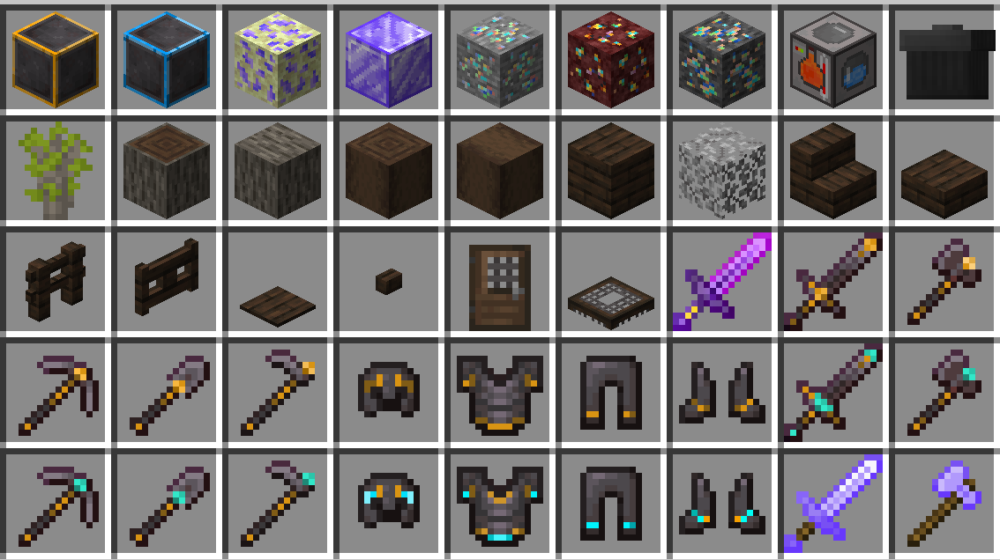
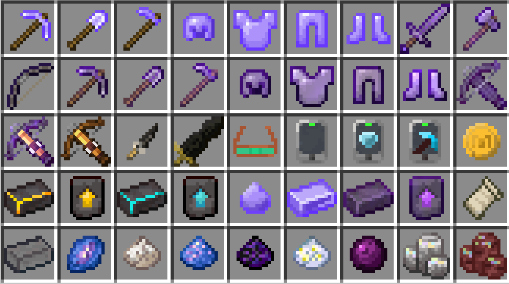

# [1.20.4]Partea Expansion-beta6模组项目文档
## 描述
本模组旨在优化与拓展原版玩法，增强探索体验，同时维持游戏的平衡
## 前置模组
1.owo-lib https://maven.wispforest.io/io/wispforest/owo-lib/

## 新增物品

1. 创造模式神剑(creative_mode_sword)，仅创造模式获得，攻击力足以秒杀实体
2. 黄金下界合金系列(golden_netherite)，由下界合金锻造升级而来，挖掘等级4
3. 钻石下界合金系列(diamond_netherite)，由黄金下界合金锻造升级而来，挖掘等级5
4. 织物(fabric)，作为合成材料或用于物品修复，由线合成
5. 结晶青金石(crystallized_lapis)，有青金石与紫水晶碎片合成而来
6. 石英粉(quartz_dust)，石英与燧石合成，用于催化质变的普通材料
7. 结晶青金石粉(crystallized_lapis_dust)，结晶青金石合成，用于催化质变的罕见材料
8. 哭泣黑曜石粉(crying_obsidian_dust)，哭泣黑曜石与钻石合成，用于催化质变的稀有材料
9. 紫水晶粗制物(crude_amethyst)，由紫水晶碎片合成
10. 紫晶钻(amethyst)：由紫水晶粗制物罕见质变而来
11. 紫水晶剑(amethyst_sword)：基础攻击和耐久均较低，跳劈无法暴击，耐久越低，伤害越高
12. 紫水晶匕首(amethyst_stilleto)：拥有22点基础攻击力，但耐久仅有1点
13. 蔚蓝矿(azure_ore)：需挖掘等级5，无视精准采集，有概率掉落一枚蔚蓝结晶，自然生成于末地外岛
14. 蔚蓝结晶(raw_azure)
15. 蔚蓝锭(azure_ingot)，由蔚蓝结晶传奇质变而来
16. 蔚蓝块(azure_block)，由蔚蓝锭合成而来
17. 夜视眼镜(night_vision_glasses)：装备于头部，提供夜视效果与少量护甲，合成获得，使用铜锭修复
18. 闲置终端(empty_terminal)：中间产物，本身无用
19. 探矿器(diamond_prospector)：探测所选方块上下的矿石
20. 安全采矿检测器(safemining_detector)：检测可否在此垂直下挖
21. 音乐唱片Shed A Light(shed_a_light_music_disc)与Silent Time(silent_time_music_disc)，分别出现在末地城与藏宝图宝藏中
22. 物品过滤器(item_filter)：设置自动吸取物品白名单或黑名单
23. 参量质变仪(qualitative_analyzer)：用于进行质变
24. 欢愉之面(fools_mask)：装备于头部，提供少量护甲，穿戴后能直视末影人，仅在地牢与林地府邸生成，使用织物修复
25. 远古珍珠(ancient_pearl)：能搜寻附近的远古城市，由末影珍珠或末影之眼稀有质变而来

## 新增机制

1. 皮革能代替兔子皮合成收纳袋
2. 白色羊毛能分解产生线
3. 鱿鱼与发光鱿鱼有40%的概率掉落黏液球
4. 附魔金苹果、三叉戟、钻石马铠与金马铠可合成
5. 在沙漠神殿考古有概率获得紫水晶
6. 部分功能方块ui改动
7. 参量质变仪：分为四阶质变。
   1. 普通质变消耗石英粉，支持煤炭/木炭--->萤石粉
   2. 罕见质变消耗结晶青金石粉，支持紫水晶粗制物--->紫金钻
   3. 稀有质变消耗哭泣黑曜石粉，支持回收铁金钻石紫水晶制的工具或装备
   4. 传奇质变消耗下界之星，支持蔚蓝结晶--->蔚蓝锭
8. 新增药水效果：
   1. 命定之死(doomed_death)：短时间内按最大生命值一定比例受到持续伤害

9. 新增附魔：
   1. 自动烧炼(auto_smelt)，附魔台获得，用于挖掘工具，与精准采集冲突，自动熔炼挖掘矿物
   2. 斩首(beheading)，附魔台获得，用于近战武器，与精准采集冲突，击杀苦力怕、僵尸、骷髅、猪灵有概率掉落其头颅，凋零骷髅掉落头颅概率提升
   3. 饱食(consumer)，附魔台获得，用于近战武器，击杀敌人概率回复饱食度
   4. 命定之死(doomed_death)，附魔台获得或古代城探索获得，用于武器，命中敌人将使其获得命定之死效果
   5. 教育(experience)：附魔台获得，用于近战武器，击杀敌人获得的经验增加
   6. 海神垂怜(god_of_the_sea)：沉船宝藏室概率获得，持有附魔物品能获得水下呼吸
   7. 冰霜附加(ice_aspect)：雪屋宝箱概率获得，用于近战武器，与火焰附加冲突，命中敌人将造成禁锢，移动速度与攻击速度大幅下降
   8. 金光闪闪(glimmering)：废弃下界传送门宝箱获得，用于鞋子，与冰霜行者冲突，能使猪灵中立
   9. 夜隐无形(nocturnal)：附魔台获得，应用于头盔，夜晚时获得隐身，受击时短暂失效
   10. 深邃♂黑暗♂幻想(deep_dark_fantasy)：击杀监守者获得，应用于弩，与其他弩附魔冲突，附魔后攻击替换为监守者远程攻击
   11. 逐火者(pyromania)：下界堡垒宝箱获得，应用于近战武器，命中燃烧中的生物时造成附加伤害
   12. 飞升(rise)：末地外岛探索概率获得，应用于弓，与火矢冲突，击中生物将施加漂浮效果
   13. 罗蕾塔的绝活(soul_seeker)：猪灵堡垒宝藏箱概率获得，应用于弓弩，射出的箭矢带有自动追踪能力
   14. 活力(vigour)：附魔台获得，应用于胸甲，能增加最大生命值
   15. 吸血(life_steal)：附魔台获得，应用于近战武器，命中敌人概率回复生命值
   16. 灾厄杀手(raider)：村庄制图师小屋概率获得，应用于近战武器，提高对灾厄村民的伤害
   17. 二段跳(dual_leap)：掠夺者前哨战概率获得，应用于鞋子，获得二段跳能力

10. 新增村民职业下界探险家(nether_explorer)，交易下界材料与矿物
11. 末地外岛新增多种自然生成结构，丰富末地外岛的探索体验
12. 新增进度赛博科技(cybertech)，还有高手！(more_power)，这就是洪荒之力？(is_it_the_ultimate_power)

## 原版内容修改

1. 退出附魔台界面，放入的青金石不会弹出
2. 学徒石匠新增收购原石与深板岩的交易
3. 真实物品掉落，物品可以平躺在地面上而不会再原地旋转，右键可直接拾取物品
4. 用水桶收纳美西螈，获得的美西螈桶材质将能够反映美西螈的年龄与颜色